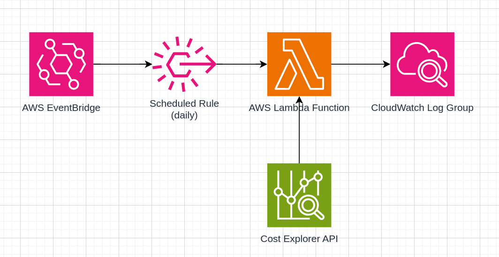

# Watchtower

Watchtower is a small utility for monitoring your AWS costs. It's designed to run on AWS Lambda, dispatched through a
scheduled AWS EventBridge rule.

WatchTower will send you a daily notification with the total cost of your AWS account for the last 15 days, as well as a
daily breakdown of the costs for the last 15 days. This is done using the Cost Explorer API.

> **Note**: The CostExplorer API costs $0.01 per request. This is a very low cost, but it's worth noting that you will
> incur this cost every time the Lambda function is executed.

## Messaging Integrations

WatchTower currently only supports Discord Webhooks for sending messages. If you'd like to see support for other
messaging integrations, feel free to open an issue or a pull request.

## Deployment

This project is designed to be deployed with Terraform. The repository is deployable as a module. See the
[variables.tf](variables.tf) file for configuration options.

Please see the [Discord documentation][discord-webhook] for information on how to create a webhook URL.

**Reference Architecture**

The reference architecture for the project deploys an AWS Lambda function that is triggered by an EventBridge rule. The
Lambda will dispatch messages to Discord, sending traces to AWS CloudWatch.



Making use of the module is as simple as including it in your Terraform configuration:

```terraform
data "aws_caller_identity" "current" {}

resource "aws_secretsmanager_secret" "watchtower_discord_webhook" {
  name = "website/prod/watchtower-discord-webhook"
}

data "aws_secretsmanager_secret_version" "watchtower_discord_webhook" {
  secret_id = aws_secretsmanager_secret.watchtower_discord_webhook.id
}

module "watchtower" {
  source = "github.com/junlarsen/watchtower"

  lambda_function_name       = "watchtower-prod"
  lambda_execution_role_name = "watchtower-prod-execution-role"
  lambda_execution_role_statements = [
    {
      effect     = "Allow"
      actions    = ["ce:GetCostAndUsage"]
      resources  = ["arn:aws:ce:us-east-1:${data.aws_caller_identity.current.account_id}:/GetCostAndUsage"]
      conditions = []
    }
  ]

  environment_variables = {
    DISCORD_WEBHOOK_URL = data.aws_secretsmanager_secret_version.watchtower_discord_webhook.secret_string
  }

  cloudwatch_log_group_name       = "/aws/lambda/watchtower-prod"
  cloudwatch_log_retention_window = 7

  output_directory = "dist"
}
```

## License

This project is licensed under the Apache 2.0 License. See the [LICENSE](LICENSE) file for more information.

[discord-webhook]: https://support.discord.com/hc/en-us/articles/228383668-Intro-to-Webhooks
